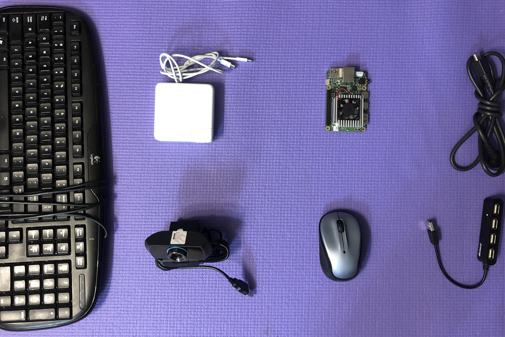
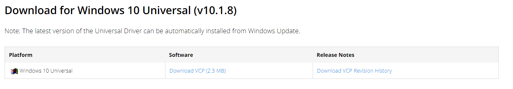
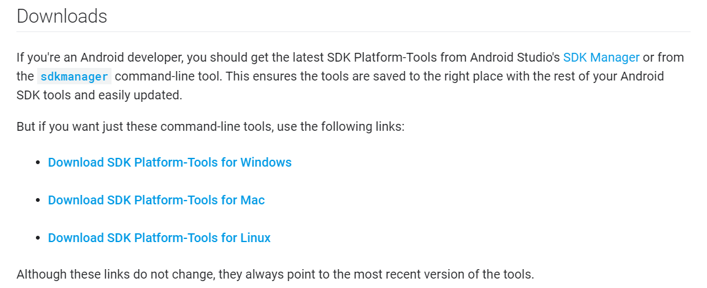
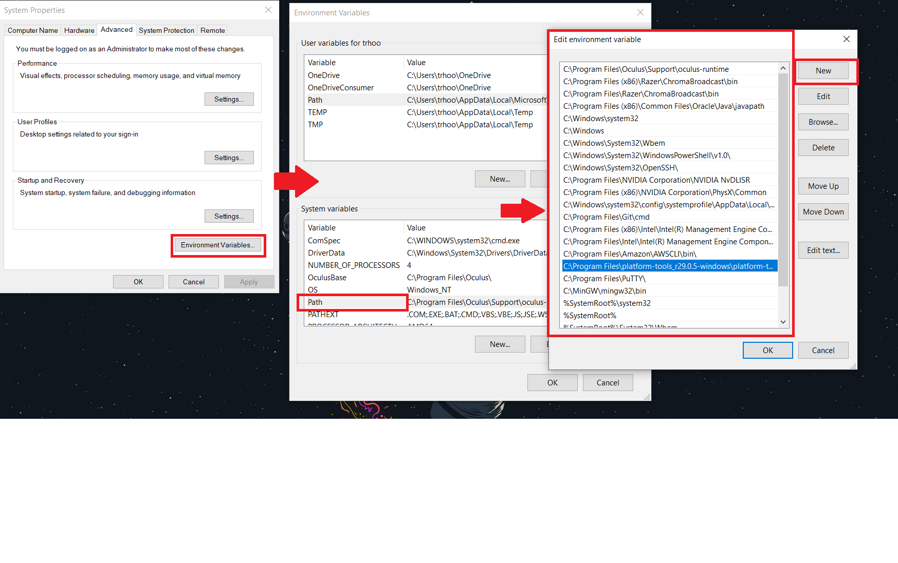
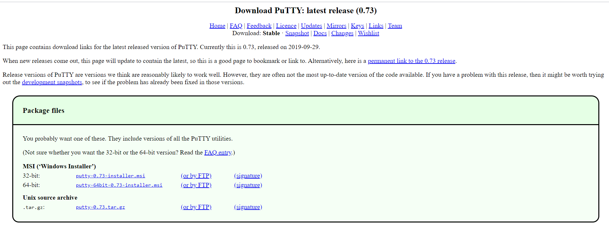
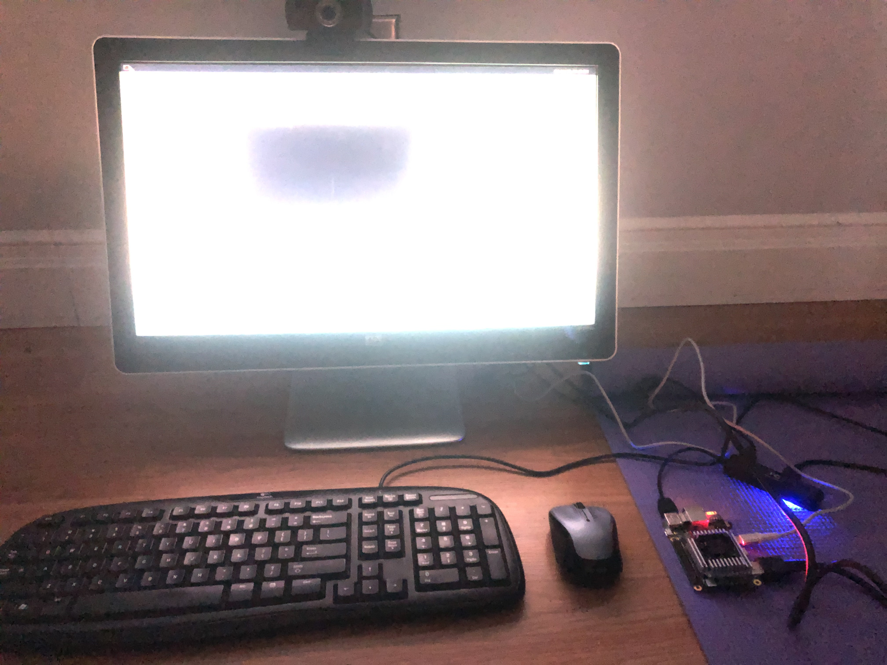

# Getting Familiar with the Coral Dev Board
Before diving in with the Coral Dev Board, I will first outline a short guide for setting up and running a demo. If you are are already familiar with the Coral Dev Board then this **is not needed**, however, this is still an excellent chance to become more familiar with the Coral Dev Board and it's capabilities.

#### Peripherals, Downloads, and Installations
Before beginning, there is some mandatory software you will need to download on your laptop. While the Coral online documentation recommends using MacOS or Linux for this process, I configured this to work for Windows 10 machines, since that is the OS most students will use. Please ensure you have the following:
1. Computer running Windows 10 - *laptop would be ideal*
2. The Coral Dev Board Kit and needed peripherals:

   - The Coral Dev Board kit - *if you are getting this from Dr. Anwar, it should be just the board with nothing else additional*
   - x1 USB-C power delivery cable w/ 5w power brick - *an Android USB-C charger will probably work, this is used to power the Coral Dev Board, be careful not to use a power source that delivers more than 5w as you can damage the board*
   - x1 USB-C data delivery cable - *yes, you need two distinct USB-C cables, another Android USB-C charger will probably work, this is used to flash Linux onto the Coral Dev Board*
   - x1 Micro-B cable - *an old Android charger will work, this is for serial communication between your laptop and the Coral Dev Board*
   - Other peripherals you may want later include: webcam, keyboard, mouse, USB hub, HDMI cable, and monitor
3. Download and install SILABS drivers:
   - On your laptop, download and install [these drivers](https://www.silabs.com/products/development-tools/software/usb-to-uart-bridge-vcp-drivers)
      - These are required to enable your computer's USB port to function as a Virtual COM Port to facilitate host communication between your computer and the Dev Board
   
4. Download and Install Android Platform Tools:
   - On your laptop, download and unzip [this folder](https://developer.android.com/studio/releases/platform-tools.html#download)
      - Place it somewhere convenient for you - **you will need to reference this spot later!**
   
   - After unzipping the folder in your chosen directory, store that file path location in your Environment and/or System PATH variable(s). 
      - For example, I unzipped the folder and placed it in my Program Files folder, so I added the following to my System Variables PATH: `C:\Program Files\platform-tools_r29.0.5-windows\platform-tools`
      
5. Download a Serial Console Application for your Laptop
   - Mac systems have `screen` installed by default, but *I use PuTTY, which is free to download*
   - 
6. *(OPTIONAL)* Micro-sd Card
   - This would enable a larger storage capacity for the dev board which might be important depending on what your use case is (ie: analyzing large datasets of images, installing large libraries and modules, etc.)

#### Recap
1. Checklist - When it's all said and done, you should have:
   - Downloaded the USB-to-UART drivers on your laptop
   - Downloaded the FastBoot drivers on your laptop
   - Have an equipment setup [similar to this](https://github.com/thood21/SeniorProject/blob/master/etc/equipment.PNG "Required Equipment") *minus the Raspberry Pi*.

#### Troubleshooting
Additionally, please find helpful links, sources, and documentation that I used along my process below:
1. Documentations and blogs:
   - Coral Dev Board [official documentation](https://coral.ai/docs/dev-board/get-started/)
   - Online blog for [connecting a Coral Dev Board to a Windows 10 machine](https://blog.questionable.services/article/coral-edge-tpu-windows/) - **If you are confident in your own ability to troubleshoot and want to go at your own pace, this guide is all you need really, and you can ignore the rest of my guide. In essence, I am rehashing this guide and adding in a few steps that worked in my case.**
2. Troubleshooting:
   - StackOverflow - [FastBoot errors](https://stackoverflow.com/questions/57776655/fastboot-devices-not-listing-coral-dev-board)
3. Fan Control
   - If your experience is similar to mine, then you will notice that the Dev Board fan is not spinning, causing the heatsink to get very hot, ultimately leading to thermal throttling. To remedy this, we will be editting a variable hidden deep within /sys. 
   - Begin by entering `sudo nano ~/.bashrc`, which opens your bashrc file, which we can use to load variables into the shell environment each time it is launched - this is crucial because instead of using `cd my/really/long/path/to/file/here`, we can just reference a variable to pull it up instantly. 
   - Right under `#for examples` in the the bashrc, make a few new lines and enter in `export fan="/sys/class/thermal/thermal_zone0/trip_point_4_temp"` then press ctrl+O (save file), enter (confirm), ctrl+X (close file), then in your terminal enter command: `source ~/.bashrc` which refreshes your bashrc file. To ensure this worked, enter `echo $fan`, which should print out that path we just stored in the bashrc.
   - Now enter command: `sudo nano $fan`, which pulls up a file with a number in it - mine shows 65000. Change this to a much smaller number - I always do 5000, then ctrl+O, enter, ctrl+X. Your fan should kick on. 
      - **Note:** This fix is not persistent after reboots, meaning when your machine turns off this change is lost, so you will want to rerun the `sudo nano $fan` command and change the number each time after reboot. 

#### Running the Demo
Next, we will quickly run a demo that showcases what the Coral Dev Board is capable of. This demo uses a trained model to classify cars amongst other objects from video streams. In this example, the model is run on top of a pre-recorded video stream of busy highway traffic.

#### Demo Setup
Before running, we will want to install a few more packages and ensure we are connected to the internet.

1. Establish setup:
   - At this point you are now able to use the Coral Dev Board like a portable computer, so use an HDMI to connect to an external monitor, and find a USB hub as well to connect a mouse, keyboard, and other USB devices (flashdrives, webcams, etc.). I personally used a wired USB keyboard, wireless 2.4ghz USB mouse, USB camera, USB hub, and USB C power supply, which is all shown running below:
   
2. Power on system
   - Once all accessories are connected, plug in your power cable and you should see a boot screen, followed by a blue-ish ocean desktop background. Only the terminal is able to be opened, which is located in the top-left corner.
3. Setup network for internet access:
   - Open a terminal and run the command `nmtui` to bring up the connection manager interface. 
   - Use the keyboard to navigate through, and add a connection. You can use either ethernet or Wi-Fi
      - **Note:** because this device lacks a browser, you will not be able to use networks that require a sign-in to access the internet. 
   - To ensure you have established a connection, run `nmcli connection show`, which should show the Name, UUID, and Device for your active connections. Wi-Fi will display `wlan0` under Device, while ethernet should show `eth0`.
4. Update software & packages:
   - In your terminal, run `sudo apt-get update`
   - After the above finishes, run `sudo apt-get dist-upgrade`. This will update all installed packages on the Coral Dev Board.
5. Install [TensorFlow lite for Python](https://www.tensorflow.org/lite/guide/python). 
   - I encountered some issues here, however it could have been from typos as there is no efficient way to copy/paste URLs to/from the Coral Dev Board. 
   - Ensure you have Python3 install by running `python3 -V`. This is going to print out the version number of your Python3 distribution; it is crucial that you use the correct version number when downloading the TensorFlow Lite package.
      - My version number is 3.5.3, so I will be running the command for 3.5.xxx. If you are encountering errors, ensure you are typing the command in correctly.
      - If this does not work, try going [here](https://github.com/tensorflow/tensorflow/issues/9722) and reading through similar issues
      - notably, try this command: `python3 -c "import wheel.pep425tags as w; print(w.get_supported())" | sed -zE 's/\),/),\n/g'`, which should print out your supported .whl types. 
 
#### Run Demo
With the setup finished, we are now ready to run the demo. Ensure you are connected to a monitor before starting.

1. Open a terminal
   - From your terminal run command: `edgetpu_demo --device`. 
      - It is possible to stream the demo over SSH, however I did not do that so I won't be giving instruction on how to do that (instructions are shown on the Coral Dev Board Online documentation). 
   - A video should now display on your screen showing cars driving on a highway. This is demonstrating a model that is attempting to identify cars, with a given percentage showing the "confidence" in classifying the object as a car.
      - You will notice that typically as cars get closer to the camera the accuracy in prediction increases.

## Return to Root
You can return to the senior project root directory [here](https://github.com/thood21/SeniorProject)
