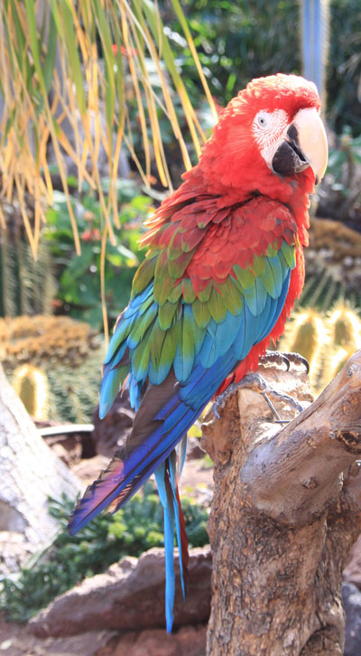
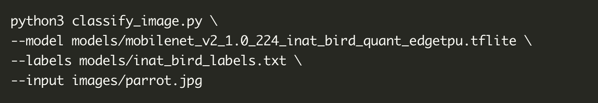
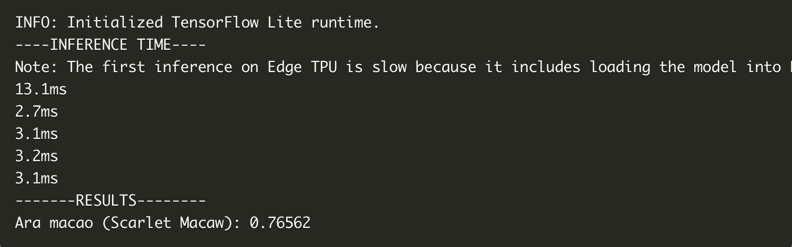

# Senior Project: Coral Dev Board Real-time Edge Analytics of Human Pose and Face
Senior Project using TensorFlow Lite on a Coral Dev Board to leverage edge analytics on human pose and face recognition and detection.

## Project Information
Below is a quick outline of relevant information for the project.

#### About Me
* Name: Tom Hood
* Majors: Applied Mathematics & Computer Science
    * Minors: Data Analytics
* Semester: Spring 2020

#### Goals of Project
This project sets out with the goal to develop scripts using Python and TensorFlow on a portable Coral Dev Board. Specifically, these scripts will be used for real-time human pose and face recognition. The Coral Dev Board will be using an attached camera to stream in video data and use real-time analytics to estimate and gauge poses and faces. Because this device is both sensing/collecting and analyzing data it is considered an edge analytics device. 

#### Other Documents 
Below is a list of other documents that are to be included in the final project/
* Summaries & Critiques
   * You can find the *Summaries & Critiques* [here](https://github.com/thood21/SeniorProject/tree/master/Summaries%26Critiques)
* Annotated Bibliography
   * You can find the *Annotated Bibliography* [here](https://github.com/thood21/SeniorProject/tree/master/AnnotatedBibliography)
* Getting Familiar with the Coral Dev Board
   * This is useful for those who have never worked with the Coral Dev Board before. This includes a guide for setting up and running a demo.
   * You can find the *documentation* [here](https://github.com/thood21/SeniorProject/tree/master/GettingFamiliarWithCoral)
   
## My Project
The below sections are pertinent to my own senior project, which is using the Coral Dev Board and TensorFlow lite to run software to detect human pose and faces

### Facial Recognition
Facial recognition is an increasingly popular use case for machine learning. Many sophisticated security systems use facial detection software to identity humans who may be committing a crime or other offense. New advancements in artificial intelligence are trying to incorporate facial recognition into their robots to increase their capabilities for communicating with humans. Facial recognition lays the foundations for more advanced actions such as emotion detection, eye-contact, and facing active speakers. 

#### Warm-Up - Image Processing
Before I began working on the code for facial recognition, I wanted to begin with a more basic form of image processing and recognition. I found a guide to help me build a model for classifying birds using the Coral Dev Board and TensorFlow lite Python API. My process is outlined below:

1. Download the example code from GitHub:
   - Open the terminal and enter in `sudo apt-get install git` to install git.
   - Next, create and enter a new directory with `mkdir coral && cd coral`. I chose the name "coral," but you are welcome to use your own.
   - Clone the git repository containing example code and needed documentation with `git clone https://github.com/google-coral/tflite.git`
2. Download the bird classifier model, labels file, and a bird photo:
    - Move into the newly downloaded repository on your machine with `cd tflite/python/examples/classification`
    - Install all requirements with `bash install_requirements.sh`
3. Start developing
   - From here you are ready to start developing.
   - Using the API, I developed a model that could classify various birds.
4. My bird model
   - The code for my model is contained in `classify_bird.py`
      - You can view the code [here](https://github.com/thood21/SeniorProject)
   - I began with an input image of a parrot, specifically a Scarlet Macaw.
   
   - I then called my script to begin classifying the image. The script takes in 3 arguments: `model`, `labels`, and `input`.
   
   - The results from the classification were a successful. The model correctly identified the bird.
   

