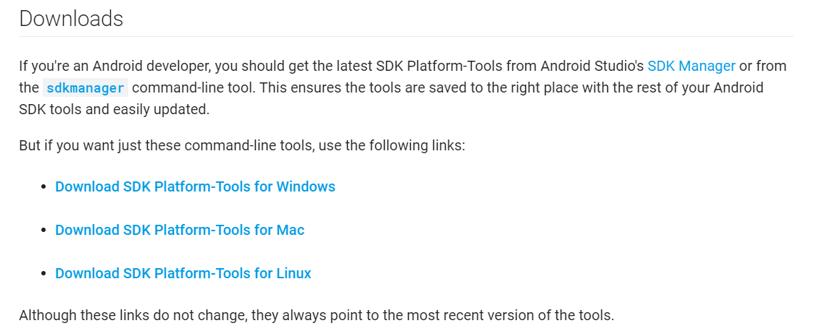

# Senior Project: Coral Dev Board Real-time Edge Analytics of Human Pose and Face
Senior Project using TensorFlow Lite on a Coral Dev Board to leverage edge analytics on human pose and face recognition and detection.

## Information
All pre-requisites and prior information needed will be detailed in the below sections.

### About Me
* Name: Tom Hood
* Majors: Applied Mathematics & Computer Science
    * Minors: Data Analytics
* Semester: Spring 2020

### Goals of Project
This project sets out with the goal to develop scripts using Python and TensorFlow on a portable Coral Dev Board. Specifically, these scripts will be used for real-time human pose and face recognition. The Coral Dev Board will be using an attached camera to stream in video data and use real-time analytics to estimate and gauge poses and faces. Because this device is both sensing/collecting and analyzing data it is considered an edge analytics device. 

### Summaries & Critiques
Going through this project, I refered to several sources for additional help. These sources were all digital, most of them blogs, recounting similar experiments using a Coral Dev Board. Below I outline these sources and offer some criticism; ideally the guide I have created below will serve as a more well-rounded and hollistic source of information for future researchers and users.

1. _Allan, Alasdair. How to use a Raspberry Pi to flash new firmware onto the Coral Dev Board. 26 March 2019. Digital Blog._
   
   This source serves as documentation for walking through the process of flashing your Coral Dev Board using a Raspberry Pi in place of tradition, recommended tools. Coral Documentation recommends using a Mac or Linux computer to flash your board, however Raspberry Pi's are robust and able to have Linux distributions flashed on to them, therefore enabling them to flash your Coral Dev Board. All things considered, this is a very good guide, and the creator even includes photos, inline code, and URLs for users following along. The biggest criticisms I find with this source is the relative lack of troubleshooting provided - realistically, many users are bound to encounter errors along the way (I certainly did), and offering a small list of common troubles and potential solutions could go a long way in assiting other users. This source inspired me to use images, inline code, and URLs in my own guide, but learning from shortcomings, I also address potential errors and offer steps and resources that I personally used to overcome these obstacles. 
   
2. _Silverlock, Matt. Connecting to a Coral TPU Dev Board with Windows. 23 March 2019. Digital Blog._
   
   This source provides excellent documentation on setting up your Coral Dev Board using a Windows machine. This post actually helped imensely with getting my own project off the ground, and the Coral Dev Board online documentation only provides resources for setting up using MacOS or Linux distributions, which would clearly be problematic considering most users (at least at Fontbonne University), will be on Windows 10. The guide offers plenty of inline code examples which is useful when copying/pasting commands on the Coral Dev Board over PuTTY, however there are absolutely no images or troubleshooting sections. As you can imagine, because this device was not created to be set up using a Windows 10 machine, there will almost undoubtedly be issues. I spent hours troubleshooting and scouring posts on GitHub and StackOverflow, and ultimately was able to figure out just enough to finish the process and flash my Coral Dev Board. Learning from these criticisms, I have included the issues I encountered, as well as the resources I used to overcome them. One final criticism with this piece is that the documentation ends somewhat abruptly without any real handoff to the users following along. In my guide below, I will walk users through all necessary set up, installations, and more, as well as include how-to's on running demo and example programs.
3. _Allan, Alasdair. Hands on with the Coral Dev Board. 26 March 2019. Digital Blog._
   
   This source is authored by the same individual who authored the first source, however in this piece he is going over the unboxing, setup, and hands on experience with the Coral Dev Board. Just like last time, the author provides a wealth of photos for users to easily follow along. In addition, the user offers some troubleshooting, mentioning that the Coral Dev Board kit does not include all the required accessories, and he explains in detail what other tools are needed to get everything up and running. I noticed as well the author encounters a common issue after flashing Mendel Linux on to the board - the fans will stop spinning, causing the board to quickly heat up and potentially thermal throttle. While he does not offer any solutions, I do note this error and offer my own solution in my guide below. The biggest takeaway for me is to focus on creating good documentation that assists future users - this includes double checking grammar and syntax, taking clear and concise images, thoroughly outline process and steps, and providing URLs and code when needed.

### Annotated Bibliography
Before beginning this project, I sought out sources that did similar projects, used similar methodologies, or used similar hardware. The purpose of this is to aggregate information from disparate sources to synthesize a blend of information into a single source to serve as a guide for future users.

1. _Aloufi, Ranya, Hamed Haddadi and David Boyle. "Emotion Filtering at the Edge." Association for Computing Machinery (2019): 1-6. Digital Article._
    * This article outlines the implementation and evaluation of emotion filtering using a Raspberry Pi 4. Because the Raspberry Pi is used as a sensor to collect data and also analyze it, it is an edge analytics device. Edge analytics has gained immense popularity recently, fueling a wave of real-time analytics as devices are able to now sensor/poll external stimuli and immediately analyze it and output results or reactions. Filtering human emotions at the edge involves devices that are able to detect changes on hosts and analyze minute changes and chain these changes together into an ultimately change in emotion. Small actions such as wrinkles around the mouth, angling of eye brows, open eye width, voice pitch, decible levels, and hesitation are a few of the many changes used to diagnose emotion. In the pursuit of creating AI, human emotion detection is a necessity, making this research an important cornerstone. Finally, this article shows that performance accuracy is not hindered by edge analytics when compared to more powerful cloud-based approaches. Traditional systems stream data back from sensors and analyze data in the cloud, which is less efficient and sometimes slower. In essence, this article demonstrates the capabilities and accuracy of edge analytics, while also pressing forward by making advances for human emotion detection. 
    
2. _Antonini, Mattia, et al. "Resource Characterisation of Personal-Scale Sensing Models on Edge Accelerators." Association for Computing Machinery (2019): 49-55. Digital Article._
    * Edge acceleration is a new class of cutting edge purpose-built or job-specific System on a Chip (SoC) for running deep learning models efficientl on edge devices. The accelerators offer a plethora of benefits such as ultra-low latency, sensitive data protection via cryptography, and extreme data availability via locality. Edge accelerators are creating opportunities for builing real-time sensory systems in the real world, and leading scientists to rethink traditional and existing solutions for IoT, wearables, and other sensory devices. This article examines the performance of a set of edge accelerators in running scaled sensory deep learning models, benchmarking a total of 8 unique models with varying architectures and tasks (motion, audio, vision) across seven platform configurations with three distinct accelerators including the Google Coral (our device), Nvidia Jetson Nano, and Intel Neural Compute Stick. The article then reports on the execution performance concerning metrics such as latency, memory usage, and power consumption while discussing the workflows and respective limitations.
    
3. _Coral. "Dev Board Datasheet." January 2020. Coral AI Docs. System Report. January 2020._
    * The datasheet outlines component specifications, capabilities, and potential use cases. The Coral Dev Board is a single-board computer that's ideal for performing fast machine learning (ML) inferencing in a small form factor. Like other boards, it's widely used for edge analytics and real-time data crunching, and can be used to prototype various embedded system and then scale to production using the on-board Coral System-on-Module (SoM) combined with any number of custom PCB hardware. The module itself provides a fully-integrated system including: an iMX 8M chip, eMMC memorym LPDDR4 RAM, Bluetooth, and Wi-Fi. However, the biggest draw to this system is the specialized Google "Edge TPU coprocessor," a small ASIC engineered by Google for extreme performance ML inferencing with power power consumption (energy efficient). The SoM provides a fully-integrated system, including NXP's iMX 8M system-on-chip (SoC), eMMC memory, LPDDR4 RAM, Wi-Fi, and Bluetooth, but its unique power comes from Google's Edge TPU coprocessor. The Edge TPU is a small ASIC designed by Google that provides high performance ML inferencing with a low power cost. On the board itself there is a healthy endowment of I/O such as: USB 2.0/3.0 ports, DSI display interface, CSI-2 camera interface, Ethernet port, speaker terminals, and a 40-pin I/O header. The key benefits of this device are as follows: complete Linux system (Mendel, derivative of Debian), prototyping capabilities, and high-speed and energy efficient ML inferencing.
    
4. _Ding, Changxing and Dacheng Tao. "A Comprehensive Survey on Pose-Invariant Face Recognition." Association for Computing Machinery (2016): Article 37. Digital Article._
    * This article studies facial recognition with unchanging (invariant) poses; this translates to analyzing still images of human faces. This type of human facial recognition is useful in certain applications such as facial biometrics recognition, but useless in others such as real-time facial recognition. Pose invariant facial recognition (PIFR) is typically grouped into four distinct categories: pose-robust feature extraction approaches, multiview subspace learning approaches, face synthesis approaches, and hybrid approaches. This article discusses the motivations, strategies, pros/cons, and performance of representative approaches and details directions for future research. Ultimately, the capacity to recognize faces under varied poses is a fundamental human ability that presents a unique challenge for computer vision systems, which spurred this group of researches to delve into a separate area of study - PIFR. 

5. _Kejariwal, Arun, Sanjeev Kulkarni and Karthik Ramasamy. "Real Time Analytics: Algorithms and Systems." Association for Computing Machinery (2015): 2040–2041. Digital Article._
    *  This article outlines example use cases of streaming analytics and notes how it powers a lot of the everyday functions we do/use. Business metrics, healthcare reports, e-commerce tracking, telecommunications, government services, and more all utilize streaming analytics. This article also presents a various applications, algorithms, and platforms for streaming analytics, as well as the evolution of the field and current challenges. Common challenges include turnover time between capture data and presenting it in analytics, efficiently handling and streaming massive amounts of data ("Big Data"), maintaining data quality standards, and making use of data you collect (otherwise, why waste resources storing useless data). In essence, the article examines the implications and effects of the "3 V's" of daya analytics - Velocity/Veracity, Volume, and Variety.

6. _Shotton, Jamie, et al. "Real-Time Human Pose Recognition in Parts from Single Depth Images." Association for Computing Machinery (2013): 116-124. Digital Article._
    * This article outlines research methods used to report real-time human pose recognition via prediction from 3D positioning of body parts and joints obtained from single depth images. While this methodology discussed is strongly remeniscent of current object recognition strategies, it does differentiate itself by utilizing an algorithm that does not depend on information from preceding image frame data. The proposed methodology breaks down images into recognizable body parts and then further into pixels, enabling per-pixel machine learning techniques to efficiently analyze data. The algorithm is able to estimate body part labels invariant to pose, body shape, clothing, and other irrelevancies. The proposed system runs in uner 5ms on the Xbox 360 (system configuration used for specific benchmarking purposes). 
    
## Getting Familiar with the Coral Dev Board
Before diving in with the Coral Dev Board, I will first outline a short guide for setting up and running a demo. If you are are already familiar with the Coral Dev Board then this **is not needed**, however, this is still an excellent chance to become more familiar with the Coral Dev Board and it's capabilities.

### Peripherals, Downloads, and Installations
Before beginning, there is some mandatory software you will need to download on your laptop. While the Coral online documentation recommends using MacOS or Linux for this process, I configured this to work for Windows 10 machines, since that is the OS most students will use. Please ensure you have the following:
1. Computer running Windows 10 - *laptop would be ideal*
2. The Coral Dev Board Kit and needed peripherals:

   - The Coral Dev Board kit - *if you are getting this from Dr. Anwar, it should be just the board with nothing else additional*
   - x1 USB-C power delivery cable w/ 5w power brick - *an Android USB-C charger will probably work, this is used to power the Coral Dev Board, be careful not to use a power source that delivers more than 5w as you can damage the board*
   - x1 USB-C data delivery cable - *yes, you need two distinct USB-C cables, another Android USB-C charger will probably work, this is used to flash Linux onto the Coral Dev Board*
   - x1 Micro-B cable - *an old Android charger will work, this is for serial communication between your laptop and the Coral Dev Board*
   - Other peripherals you may want later include: webcam, keyboard, mouse, USB hub, HDMI cable, and monitor
3. Download and install SILABS drivers:
   - On your laptop, download and install [these drivers](https://www.silabs.com/products/development-tools/software/usb-to-uart-bridge-vcp-drivers)
      - These are required to enable your computer's USB port to function as a Virtual COM Port to facilitate host communication between your computer and the Dev Board
   - 
4. Download and Install Android Platform Tools:
   - On your laptop, download and unzip [this folder](https://developer.android.com/studio/releases/platform-tools.html#download)
      - Place it somewhere convenient for you - **you will need to reference this spot later!**
   - 
   - After unzipping the folder in your chosen directory, store that file path location in your Environment and/or System PATH variable(s). 
      - For example, I unzipped the folder and placed it in my Program Files folder, so I added the following to my System Variables PATH: `C:\Program Files\platform-tools_r29.0.5-windows\platform-tools`
      - 
5. Download a Serial Console Application for your Laptop
   - Mac systems have `screen` installed by default, but *I use PuTTY, which is free to download*
   - 
6. *(OPTIONAL)* Micro-sd Card
   - This would enable a larger storage capacity for the dev board which might be important depending on what your use case is (ie: analyzing large datasets of images, installing large libraries and modules, etc.)

### Recap
1. Checklist - When it's all said and done, you should have:
   - Downloaded the USB-to-UART drivers on your laptop
   - Downloaded the FastBoot drivers on your laptop
   - Have an equipment setup [similar to this](https://github.com/thood21/SeniorProject/blob/master/etc/equipment.PNG "Required Equipment") *minus the Raspberry Pi*.

### Troubleshooting
Additionally, please find helpful links, sources, and documentation that I used along my process below:
1. Documentations and blogs:
   - Coral Dev Board [official documentation](https://coral.ai/docs/dev-board/get-started/)
   - Online blog for [connecting a Coral Dev Board to a Windows 10 machine](https://blog.questionable.services/article/coral-edge-tpu-windows/) - **If you are confident in your own ability to troubleshoot and want to go at your own pace, this guide is all you need really, and you can ignore the rest of my guide. In essence, I am rehashing this guide and adding in a few steps that worked in my case.**
2. Troubleshooting:
   - StackOverflow - [FastBoot errors](https://stackoverflow.com/questions/57776655/fastboot-devices-not-listing-coral-dev-board)
3. Fan Control
   - If your experience is similar to mine, then you will notice that the Dev Board fan is not spinning, causing the heatsink to get very hot, ultimately leading to thermal throttling. To remedy this, we will be editting a variable hidden deep within /sys. 
   - Begin by entering `sudo nano ~/.bashrc`, which opens your bashrc file, which we can use to load variables into the shell environment each time it is launched - this is crucial because instead of using `cd my/really/long/path/to/file/here`, we can just reference a variable to pull it up instantly. 
   - Right under `#for examples` in the the bashrc, make a few new lines and enter in `export fan="/sys/class/thermal/thermal_zone0/trip_point_4_temp"` then press ctrl+O (save file), enter (confirm), ctrl+X (close file), then in your terminal enter command: `source ~/.bashrc` which refreshes your bashrc file. To ensure this worked, enter `echo $fan`, which should print out that path we just stored in the bashrc.
   - Now enter command: `sudo nano $fan`, which pulls up a file with a number in it - mine shows 65000. Change this to a much smaller number - I always do 5000, then ctrl+O, enter, ctrl+X. Your fan should kick on. 
      - **Note:** This fix is not persistent after reboots, meaning when your machine turns off this change is lost, so you will want to rerun the `sudo nano $fan` command and change the number each time after reboot. 

### Running the Demo
Next, we will quickly run a demo that showcases what the Coral Dev Board is capable of. This demo uses a trained model to classify cars amongst other objects from video streams. In this example, the model is run on top of a pre-recorded video stream of busy highway traffic.

#### Demo Setup
Before running, we will want to install a few more packages and ensure we are connected to the internet.

1. Establish setup:
   - At this point you are now able to use the Coral Dev Board like a portable computer, so use an HDMI to connect to an external monitor, and find a USB hub as well to connect a mouse, keyboard, and other USB devices (flashdrives, webcams, etc.). I personally used a wired USB keyboard, wireless 2.4ghz USB mouse, USB camera, USB hub, and USB C power supply, which is all shown running below:
   - 
2. Power on system
   - Once all accessories are connected, plug in your power cable and you should see a boot screen, followed by a blue-ish ocean desktop background. Only the terminal is able to be opened, which is located in the top-left corner.
3. Setup network for internet access:
   - Open a terminal and run the command `nmtui` to bring up the connection manager interface. 
   - Use the keyboard to navigate through, and add a connection. You can use either ethernet or Wi-Fi
      - **Note:** because this device lacks a browser, you will not be able to use networks that require a sign-in to access the internet. 
   - To ensure you have established a connection, run `nmcli connection show`, which should show the Name, UUID, and Device for your active connections. Wi-Fi will display `wlan0` under Device, while ethernet should show `eth0`.
4. Update software & packages:
   - In your terminal, run `sudo apt-get update`
   - After the above finishes, run `sudo apt-get dist-upgrade`. This will update all installed packages on the Coral Dev Board.
5. Install [TensorFlow lite for Python](https://www.tensorflow.org/lite/guide/python). 
   - I encountered some issues here, however it could have been from typos as there is no efficient way to copy/paste URLs to/from the Coral Dev Board. 
   - Ensure you have Python3 install by running `python3 -V`. This is going to print out the version number of your Python3 distribution; it is crucial that you use the correct version number when downloading the TensorFlow Lite package.
      - My version number is 3.5.3, so I will be running the command for 3.5.xxx. If you are encountering errors, ensure you are typing the command in correctly.
      - If this does not work, try going [here](https://github.com/tensorflow/tensorflow/issues/9722) and reading through similar issues
      - notably, try this command: `python3 -c "import wheel.pep425tags as w; print(w.get_supported())" | sed -zE 's/\),/),\n/g'`, which should print out your supported .whl types. 
 
#### Run Demo
With the setup finished, we are now ready to run the demo. Ensure you are connected to a monitor before starting.

1. Open a terminal
   - From your terminal run command: `edgetpu_demo --device`. 
      - It is possible to stream the demo over SSH, however I did not do that so I won't be giving instruction on how to do that (instructions are shown on the Coral Dev Board Online documentation). 
   - A video should now display on your screen showing cars driving on a highway. This is demonstrating a model that is attempting to identify cars, with a given percentage showing the "confidence" in classifying the object as a car.
      - You will notice that typically as cars get closer to the camera the accuracy in prediction increases.

## My Project
The below sections are pertinent to my own senior project, which is using the Coral Dev Board and TensorFlow lite to run software to detect human pose and faces

### Facial Recognition
Facial recognition is an increasingly popular use case for machine learning. Many sophisticated security systems use facial detection software to identity humans who may be committing a crime or other offense. New advancements in artificial intelligence are trying to incorporate facial recognition into their robots to increase their capabilities for communicating with humans. Facial recognition lays the foundations for more advanced actions such as emotion detection, eye-contact, and facing active speakers. 

#### Setup
I 

